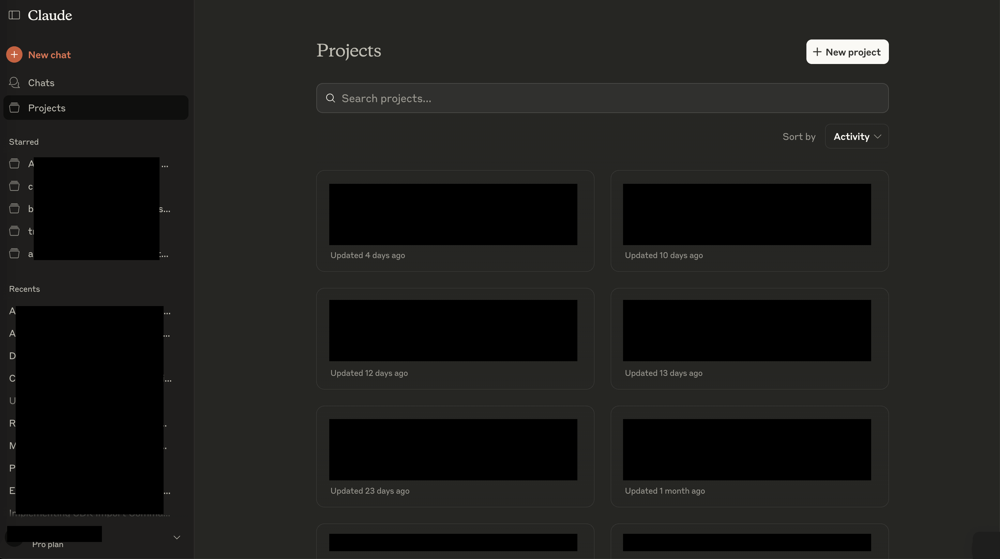
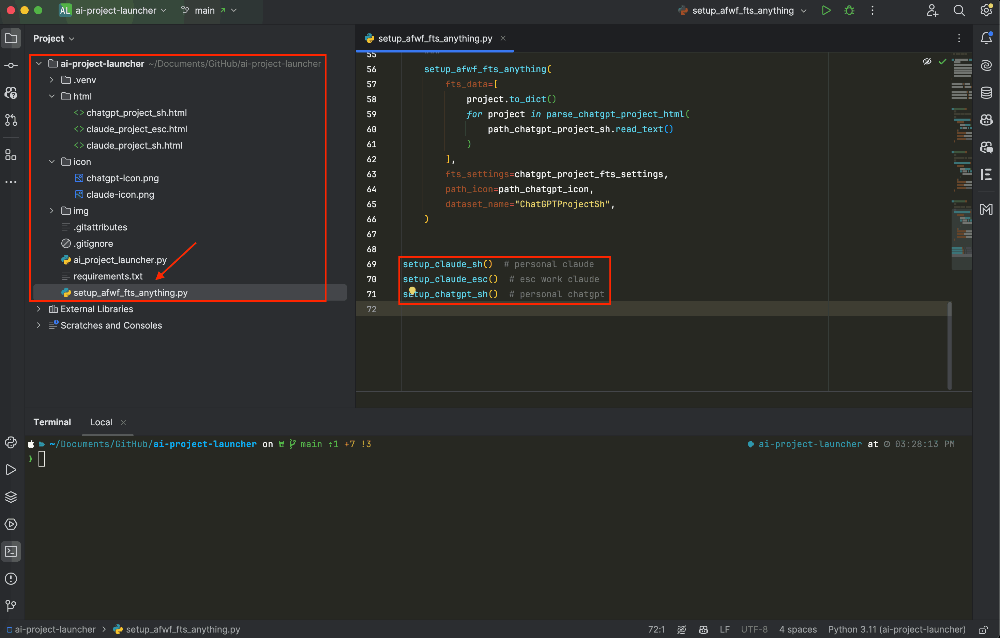
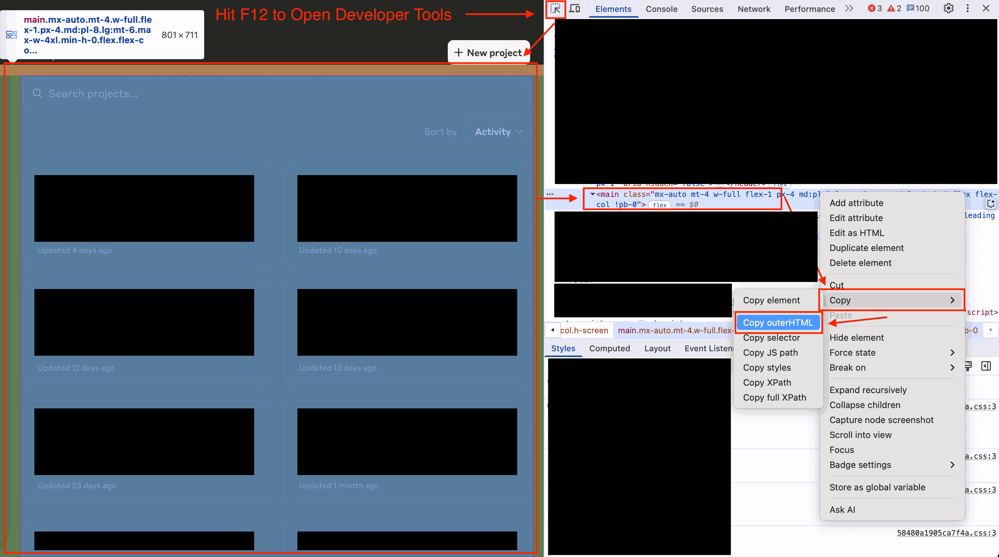
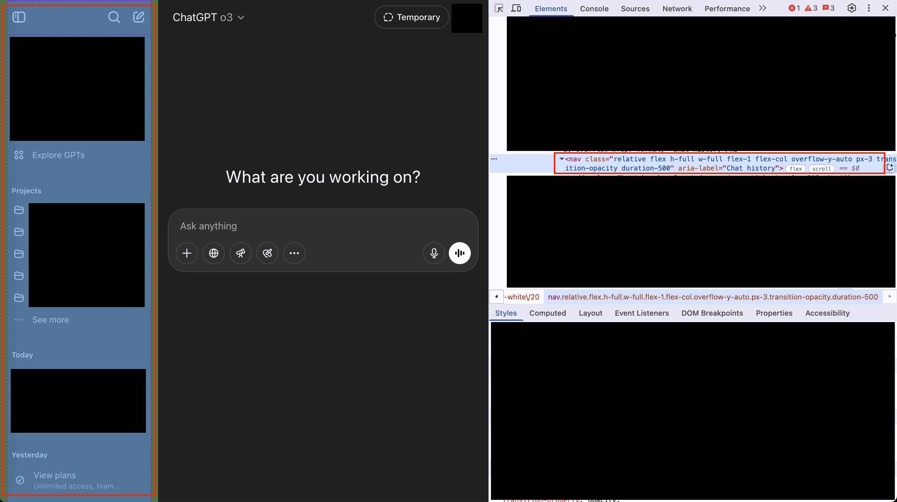
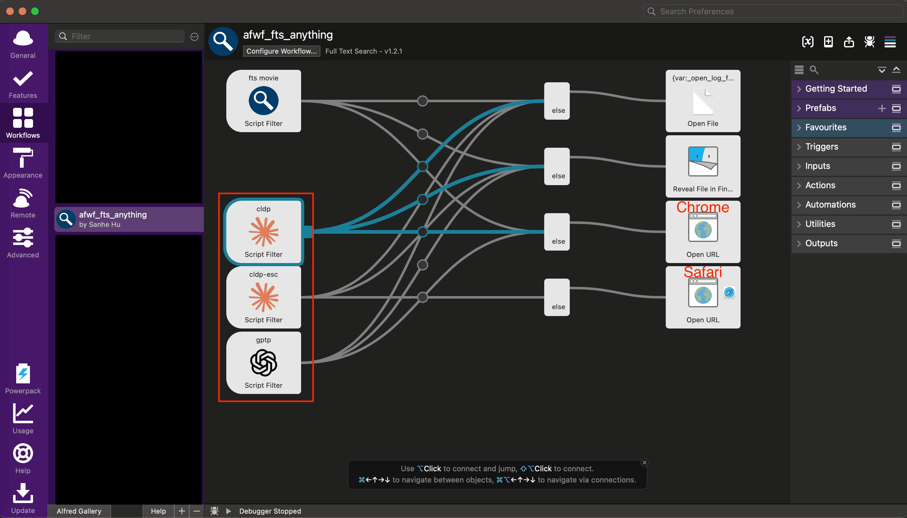
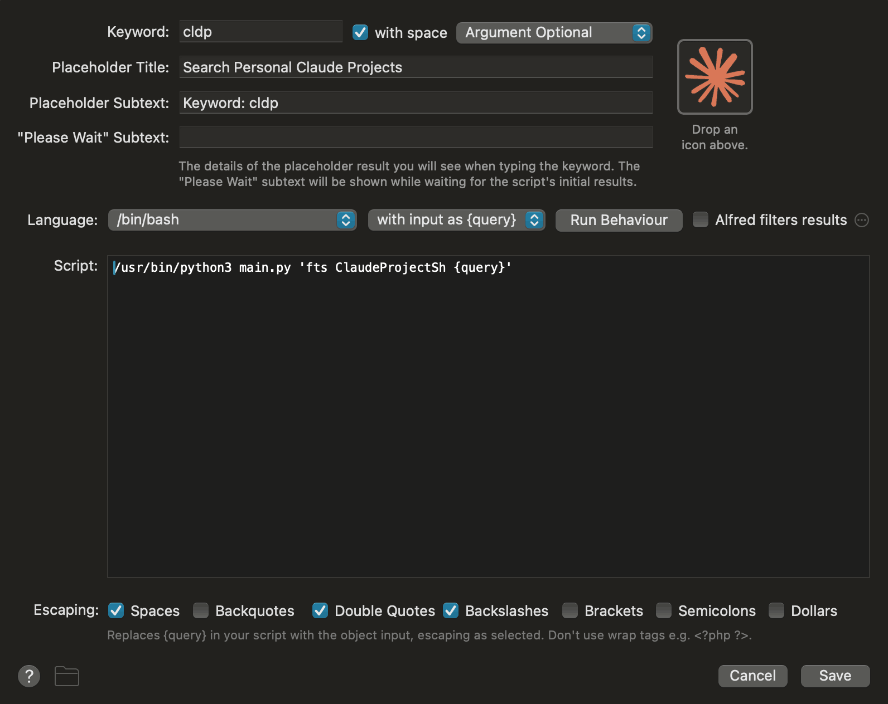
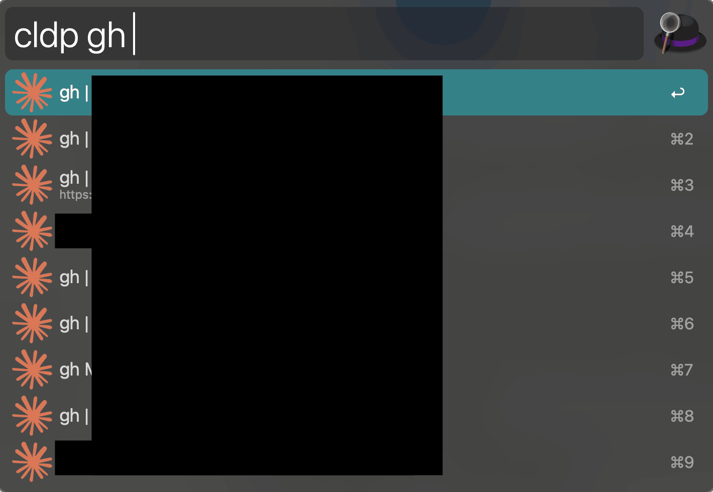
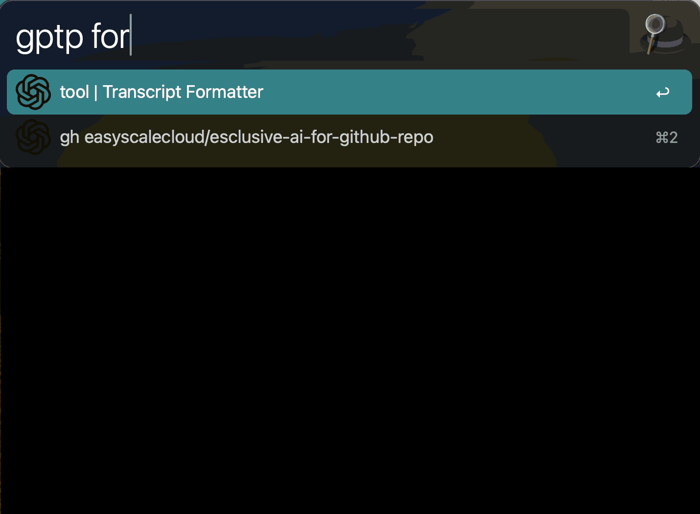

# Supercharge AI Project Access: Building a Lightning-Fast AI Project Launcher with Alfred

- [Overview](#overview)
- [The Problem: AI Project Overload](#the-problem-ai-project-overload)
- [The Solution: Alfred + afwf_fts_everything](#the-solution-alfred-afwf_fts_everything)
- [Implementation: Extracting Project Data](#implementation-extracting-project-data)
- [The Complete Workflow](#the-complete-workflow)
- [The Power of Specialized AI Assistants](#the-power-of-specialized-ai-assistants)
- [About EasyScaleCloud](#about-easyscalecloud)

## Overview

I built a blazing-fast AI project launcher that lets me instantly search and access hundreds of Claude and ChatGPT projects with just a few keystrokes. By combining Alfred's workflow capabilities with full-text search indexing, I transformed a cumbersome browser-based workflow into a seamless keyboard-driven experience that scales perfectly with my growing collection of AI projects.

## The Problem: AI Project Overload

If you're like me, you've discovered the power of [Claude](https://www.anthropic.com/news/projects) and [ChatGPT](https://help.openai.com/en/articles/10169521-using-projects-in-chatgpt) projects—those incredibly useful custom AI setups where you can define instructions and upload knowledge base files for specialized AI assistants. They're brilliant for creating purpose-built AI tools for coding, research, writing, and business tasks.

But there's a catch: **success breeds complexity**.

I soon found myself managing hundreds of these projects across different accounts and platforms. The native interfaces, while functional, presented two significant challenges:

1. **Cumbersome access workflow**: Opening the browser, navigating to the AI platform, finding the projects page, clicking the search field, and typing my query—all before actually launching the project I needed.
2. **Imprecise search capabilities**: Both Claude and ChatGPT only support basic prefix searches with exact spelling requirements. Their default search logic returns projects that match any token in my query, often flooding me with irrelevant results.

What I needed was dead simple: type a few characters, see relevant matches instantly, and launch my project with a single keystroke—regardless of which platform or account hosted it.

## The Solution: Alfred + afwf_fts_everything

As a long-time Mac power user, [Alfred](https://www.alfredapp.com/) has been my go-to productivity tool for years. Its workflow capabilities make it the perfect foundation for a custom launcher.

The missing piece was [afwf\_fts\_anything](https://github.com/MacHu-GWU/afwf_fts_anything-project) (Full-Text Search Workflow), a powerful Alfred plugin I developed that enables full-text search on custom JSON datasets. With these two tools, I could build exactly what I needed—as long as I could extract my AI project metadata.

## Implementation: Extracting Project Data

After extensive research, I discovered no official API exists for retrieving Claude or ChatGPT project catalogs. While some community members have attempted to reverse-engineer API endpoints using captured HTTP traffic, this approach violates platform policies and risks account bans.

The elegant solution came from the browser itself: the project catalog HTML pages already contain all the metadata I needed. By extracting this information with a simple Python parser, I could build my search index without violating any terms of service.

## The Complete Workflow

Let's walk through the entire implementation process:

### Step 1: Set Up the Git Repository

Start by creating a Git repository with the following structure: [easyscalecloud/ai-project-launcher](https://github.com/easyscalecloud/ai-project-launcher).

- [html/](https://github.com/easyscalecloud/ai-project-launcher/tree/main/html): Store HTML containing project catalog data
- [icon/](https://github.com/easyscalecloud/ai-project-launcher/tree/main/icon): Icons for Alfred UI
- [ai\_project\_launcher.py](https://github.com/easyscalecloud/ai-project-launcher/blob/main/ai_project_launcher.py): Core Python library (don't modify) for extracting project catalog data from HTML and setting up a full-text search index for `afwf_fts_anything`
- [**setup\_afwf\_fts\_anything.py**](https://github.com/easyscalecloud/ai-project-launcher/blob/main/setup_afwf_fts_anything.py): User automation script

### Step 2: Extract Project Catalog HTML

Periodically (every few days or whenever I create new projects), I:

- Log into my Claude or ChatGPT account
- Use developer tools to copy the HTML containing project data
- Paste it into the corresponding file in the [html/](https://github.com/easyscalecloud/ai-project-launcher/tree/main/html) folder

### Step 3: Build the Search Index

Run the [setup\_afwf\_fts\_anything.py](https://github.com/easyscalecloud/ai-project-launcher/blob/main/setup_afwf_fts_anything.py) script to process the HTML and generate the search index for the Alfred workflow.

### Step 4: Configure Alfred Workflow

Following the official guide in [afwf\_fts\_everything](https://github.com/MacHu-GWU/afwf_fts_anything-project), I configured the Alfred workflow with custom settings.

Since I maintain separate Claude accounts for personal and work use (which can't be simultaneously logged into the same browser), I directed the workflow to open projects in different browsers—Chrome for one account and Safari for the other.

### Step 5: Search and Launch AI Projects

With everything configured, I can now:

1. Trigger Alfred with my keyboard shortcut
2. Type my configured keyword to bring up the AI project search
3. Enter search terms for instant, precise results
4. Press Enter to launch the selected project in the appropriate browser

### Maintenance and Updates

The beauty of this system is its simplicity:

- Steps 1 and 4 are one-time setup processes
- Whenever I need to refresh my project data, I only need to repeat steps 2 and 3—a process that takes less than a minute

## The Power of Specialized AI Assistants

This solution leverages the true power of customizable AI assistants tailored to specific problems or projects across various domains. By creating a frictionless way to access these specialized tools, I've transformed how I interact with AI on a daily basis.

The real value lies in creating an ecosystem of purpose-built AI assistants that excel at specific tasks—and then being able to summon exactly the right assistant within seconds. This approach dramatically enhances productivity by ensuring I always have the optimal AI tool at my fingertips, without the cognitive overhead of navigating through a maze of projects.

## About EasyScaleCloud

[EasyScaleCloud](https://www.easyscalecloud.com/) is pioneering the AI-driven workspace. Our team consists solely of founders and AI technologies—no full-time human employees. This project launcher was initially developed by our founders and is now central to our daily operations, enabling AI to deliver value that would traditionally require numerous human workers.

We focus on rapidly developing AI and data products that provide quick ROI for both enterprises and individuals. Explore our offerings:

- [EasyScaleCloud Products](https://www.easyscalecloud.com/products)
- [EasyScaleCloud Services](https://www.easyscalecloud.com/services)